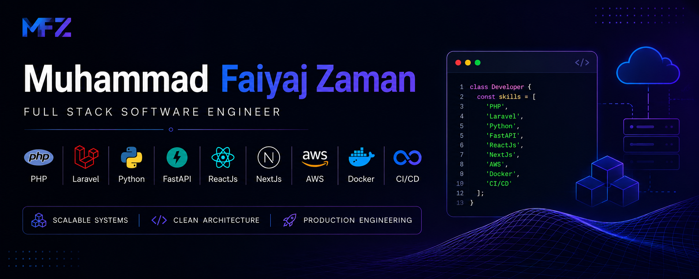
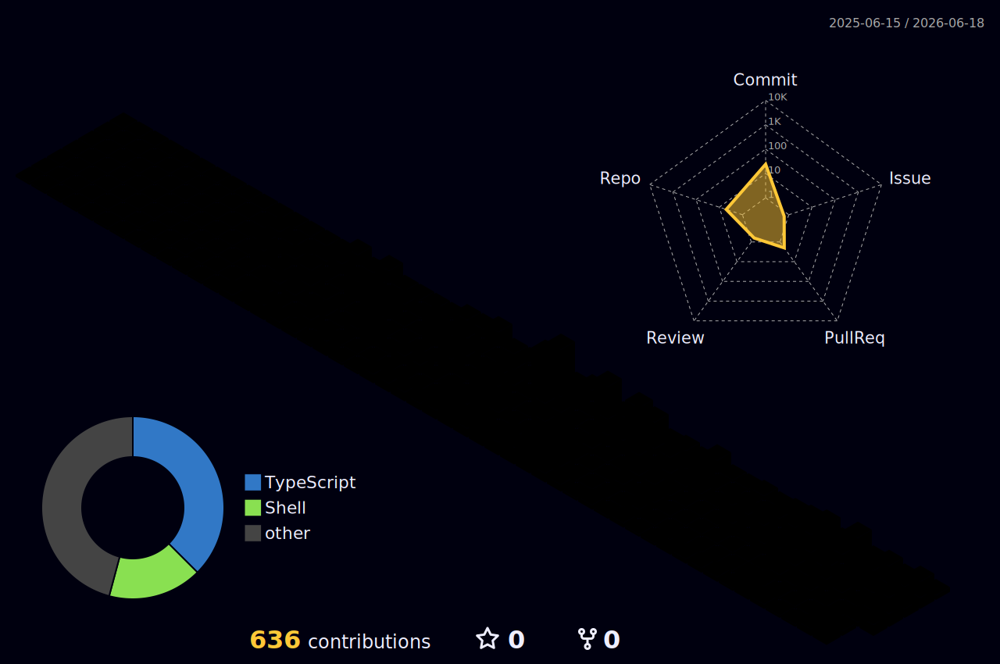

  

<h1 align="center">
  Hi 👋, I'm <b>Muhammad Faiyaj Zaman</b>
</h1>

<h3 align="center">
  Full Stack Software Engineer • Backend Architect • Technical Lead
</h3>

  Building scalable systems, production-grade applications, and developer-focused solutions.

---

# About Me

I’m a Full Stack Software Engineer focused on designing and building scalable, maintainable, and production-grade software systems with clean architecture and strong engineering standards.

My experience spans backend engineering, frontend development, API architecture, cloud infrastructure, DevOps workflows, and production deployment. I enjoy solving complex business problems through software and building systems optimized for scalability, performance, and long-term maintainability.

I focus on:
- Clean & modular architecture
- Scalable backend systems
- Developer productivity
- Performance optimization
- CI/CD automation
- Technical leadership
- Long-term product engineering

---

# Tech Stack

## Backend & APIs

  
  
  
  
  

---

## Frontend & UI

  
  
  
  
  
  

---

## Cloud, DevOps & Infrastructure

  
  
  
  
  

---

# Production Expertise

I build and maintain business-critical systems where reliability, maintainability, and clear architecture matter. My production experience is centered on backend-heavy platforms, modular business workflows, and full-stack delivery for real operational teams.

## Enterprise Platforms
- Designed ERP-style modules for suppliers, inventory, activity logs, reporting, and operational workflows
- Built maintainable service boundaries for complex business rules and role-based access
- Worked on systems that need clean data flow, auditability, and long-term extensibility

## SaaS & Product Systems
- Developed backend APIs and full-stack features for SaaS-style applications
- Integrated dashboards, admin panels, permissions, notifications, and workflow automation
- Focused on shipping practical product features without compromising code quality

## Communication & Automation
- Built email and communication workflows with queue processing, API integrations, and modular services
- Improved developer and operational workflows through automation, CI/CD, and deployment practices
- Designed systems to reduce manual effort while keeping behavior observable and controlled

## Analytics & Operations
- Built reporting and analytics features for business visibility and KPI monitoring
- Worked on HRM and hospitality workflows including employees, attendance, permissions, reservations, and administration
- Translated operational requirements into structured, scalable software modules

---

# Engineering Focus

- Backend architecture with Laravel, PHP, Python, FastAPI, and REST APIs
- Modular system design using clean code, SOLID principles, and service-oriented boundaries
- Database-backed business logic with attention to data integrity, performance, and maintainability
- CI/CD pipelines, deployment workflows, Linux servers, Docker, Nginx, and cloud infrastructure
- Queue-based processing, API integrations, automation, and production workflow design
- Technical leadership through code review, planning, mentoring, and delivery ownership

---

# Selected Work

Most of my production work is private or confidential, so I describe it by system type and engineering responsibility.

## ERP & Operations Platform
- Designed and implemented modules for suppliers, inventory, activity tracking, reporting, and administrative workflows
- Focused on modular architecture, maintainable business rules, and scalable backend services

## HRM System
- Built employee management, attendance, permissions, and workflow automation features
- Designed role-based access patterns and structured backend logic for operational teams

## Email & Communication Platform
- Worked on queue-driven email workflows, API integrations, template handling, and backend services
- Improved reliability and maintainability for communication-heavy business processes

## Analytics & Dashboard Systems
- Developed reporting interfaces, KPI views, and data-driven workflows
- Connected backend data structures with frontend dashboards for clearer business visibility

---

# GitHub Analytics

  
  
  

---

# GitHub Trophies

  

---

# 3D Contribution Graph

  

---

# Connect With Me

  

  

---

  <i>
    "Clean architecture, scalable systems, and automation — the foundation of impactful software engineering."
  </i>

