<!-- Profile panels use a transparent SVG terminal-card system, adapted for Faiyajz. -->

<picture>
  <source media="(prefers-color-scheme: dark)" srcset="assets/header-dark.svg">
  <source media="(prefers-color-scheme: light)" srcset="assets/header-light.svg">
  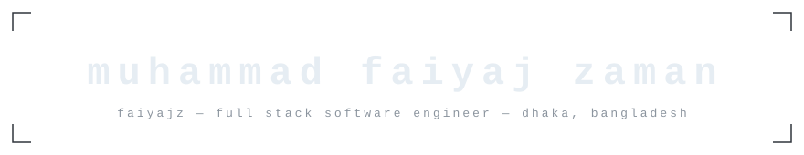
</picture>

  
  
  

<picture><source media="(prefers-color-scheme: dark)" srcset="assets/whoami-dark.svg"><source media="(prefers-color-scheme: light)" srcset="assets/whoami-light.svg">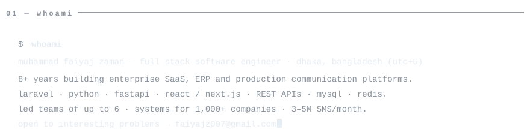</picture>

<picture><source media="(prefers-color-scheme: dark)" srcset="assets/ecosystem-dark.svg"><source media="(prefers-color-scheme: light)" srcset="assets/ecosystem-light.svg">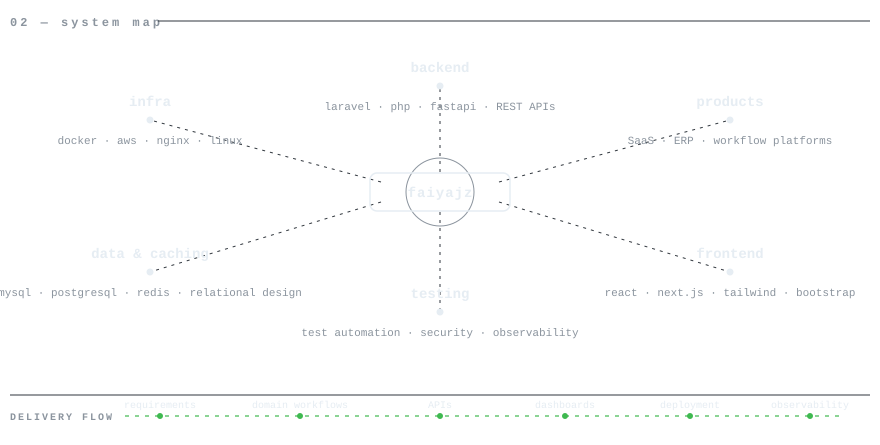</picture>

<picture><source media="(prefers-color-scheme: dark)" srcset="assets/projects-dark.svg"><source media="(prefers-color-scheme: light)" srcset="assets/projects-light.svg"></picture>

  <a href="https://github.com/Faiyajz"><picture><source media="(prefers-color-scheme: dark)" srcset="assets/proj-starter-dark.svg"><source media="(prefers-color-scheme: light)" srcset="assets/proj-starter-light.svg">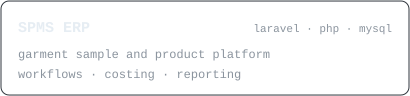</picture></a>
  <a href="https://github.com/Faiyajz"><picture><source media="(prefers-color-scheme: dark)" srcset="assets/proj-algorithms-dark.svg"><source media="(prefers-color-scheme: light)" srcset="assets/proj-algorithms-light.svg">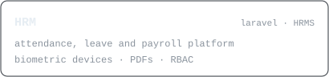</picture></a>
  <a href="https://github.com/Faiyajz"><picture><source media="(prefers-color-scheme: dark)" srcset="assets/proj-wigolo-dark.svg"><source media="(prefers-color-scheme: light)" srcset="assets/proj-wigolo-light.svg">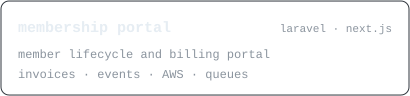</picture></a>
  <a href="https://github.com/Faiyajz"><picture><source media="(prefers-color-scheme: dark)" srcset="assets/proj-career-dark.svg"><source media="(prefers-color-scheme: light)" srcset="assets/proj-career-light.svg">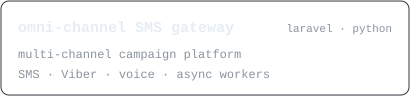</picture></a>
  <a href="https://github.com/Faiyajz"><picture><source media="(prefers-color-scheme: dark)" srcset="assets/proj-textile-dark.svg"><source media="(prefers-color-scheme: light)" srcset="assets/proj-textile-light.svg">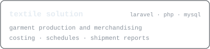</picture></a>

<picture><source media="(prefers-color-scheme: dark)" srcset="assets/telemetry-dark.svg"><source media="(prefers-color-scheme: light)" srcset="assets/telemetry-light.svg">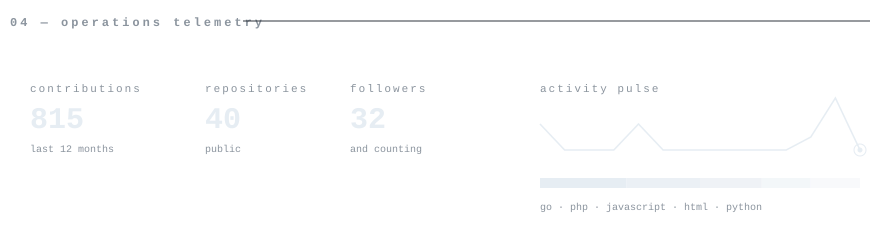</picture>

<picture>
  <source media="(prefers-color-scheme: dark)" srcset="https://github-readme-activity-graph.vercel.app/graph?username=Faiyajz&hide_border=true&radius=0&area=true&custom_title=CONTRIBUTION%20HEAT%20%2F%20RECENT%20ACTIVITY&bg_color=00000000&color=8b949e&line=e6edf3&point=e6edf3&area_color=e6edf3">
  <source media="(prefers-color-scheme: light)" srcset="https://github-readme-activity-graph.vercel.app/graph?username=Faiyajz&hide_border=true&radius=0&area=true&custom_title=CONTRIBUTION%20HEAT%20%2F%20RECENT%20ACTIVITY&bg_color=00000000&color=57606a&line=000000&point=000000&area_color=000000">
  
</picture>

<picture><source media="(prefers-color-scheme: dark)" srcset="assets/route-dark.svg"><source media="(prefers-color-scheme: light)" srcset="assets/route-light.svg">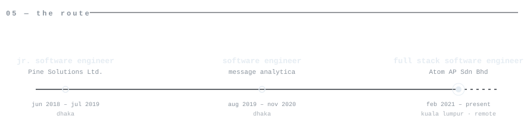</picture>

<picture><source media="(prefers-color-scheme: dark)" srcset="assets/stack-dark.svg"><source media="(prefers-color-scheme: light)" srcset="assets/stack-light.svg">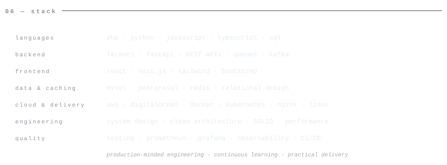</picture>

<picture><source media="(prefers-color-scheme: dark)" srcset="assets/footer-dark.svg"><source media="(prefers-color-scheme: light)" srcset="assets/footer-light.svg">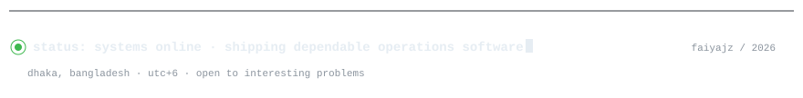</picture>
